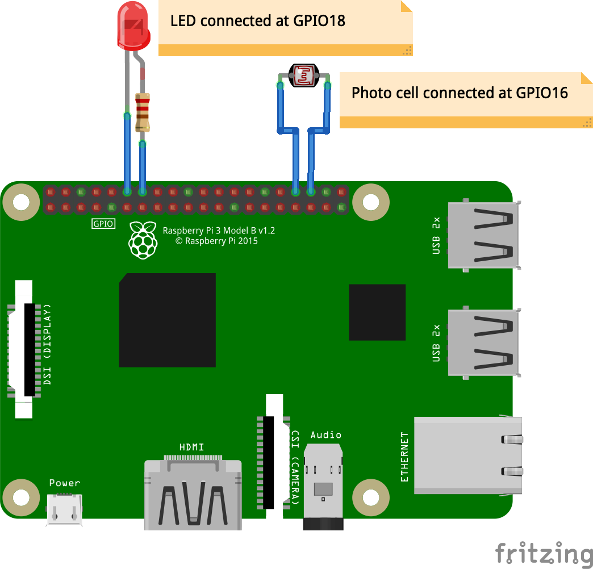

# Step 2 - Hardware Wiring

> Approximate time: 10-15 minutes

## GPIO Pins

A powerful feature of the Raspberry Pi is the row of **GPIO** (general-purpose input/output) pins along the top edge of the board. A 40-pin GPIO header is found on all current Raspberry Pi boards (unpopulated on Pi Zero and Pi Zero W).

Any of the GPIO pins can be designated (in software) as an input or output pin and used for a wide range of purposes.


### Outputs
A GPIO pin designated as an output pin can be set to high (3.3V) or low (0V).

### Inputs
A GPIO pin designated as an input pin can be read as high (3.3V) or low (0V). This is made easier with the use of internal pull-up or pull-down resistors.

### Pinouts
[**https://pinout.xyz**](https://pinout.xyz/) is an awesome site to interactively play with the GPIO pins.

## Connecting LED & Light Sensor (Photo Resistor Cell) to GPIO

> **WARNING:** Ensure the Raspberry Pi powered off, and disconnected from the power supply. The Raspberry Pi GPIO does not have any kind of fuse or protection circuit. If you short circuit your pins, you might damage your GPIO pins or even the Pi, rendering it useless.



### LED

When you hold the LED, the longer leg is the `anode` or the **positive** terminal. This is always connected to the GPIO pin, and the `cathode` or the **negative** terminal is connected to `ground` (return, to complete the circuit).

 * Connect anode of the LED to `GPIO18`
   * Always add a resistor in the circuit, when connecting an LED
 * Connect the cathode of the LED to `GND` (return circuit).

LEDs are generally rated for 2.1V, 20 to 30 mA. It is always recommended to run LEDs at 5-7 mA lower than their maximum current, to prevent burn out.

> For a `20mA` LED, with a max current of `25mA`, resistor of `65-70Ω` or for a `30mA LED, 45Ω` is enough. There are lots of calculators online. If you know your LED rating, you can calculate the resistance. A lot of LED "packages" come with preset LEDs.

### Light Sensor (Photo resistor cell)

The photo resistor is pretty straight forward to connect.

 * Connect one terminal of the cell to `GPIO16`.
 * Connect the other terminal of the cell to `GND`.

### Test

Once you have connected the two components, power up the pi and `ssh` into it again (you should know this by now). The IP address should not change.

Download the test program `simple-gpio.py`
```
wget https://raw.githubusercontent.com/varunmehta/dive-into-iot/master/code/pi/src/simple-gpio.py
```

#### The Program

```
"""
# simple-gpio.py

    This is a simple GPIO program to test whether the hardware
    connection works as expected or not. It flashes the LED
    depending upon state of LightSensor, when dark the led
    should shine, when bright, it should turn off.

"""
import config

from gpiozero import LED
from gpiozero import LightSensor

from time import sleep

sensor = LightSensor(config.PIN_LIGHT_SENSOR)
led = LED(config.PIN_LED)

def sensor_dark():
    print("night time?")
    led.on

def sensor_light():
    print("day time!")
    led.off

def led_test():
    print("Turning on LED")
    led.on()
    sleep(1)
    print("Turning off LED")
    led.off()
    sleep(1)

print ("starting tests...")

led_test()

sensor.when_dark = sensor_dark
sensor.when_light = sensor_light
```

#### Run the program

```
python3 simple-gpio.py
```

 * Cover the photocell with your hand, or a cup.
 * The LED should turn on
 * Shine light on the photocell, the LED should turn off.

> If the LED does not turn on, please verify your connections again.

## Other hardware thumb rules (General reading for later)

This section is not relevant to the lab, but added for extra reading later.

### Connecting multiple hardware

The 3.3V pin of the pin, does not give more than 50mA. If you want to control a LED strip, or multiple components, make sure each of them have their own power supply.


### HATs & pHATs
You can extend your pi with more external hardware using different types of **HATs** (**H**ardware **A**ttached on **T**op) or **pHATs** (for Pi Zero's).

Some of my favourite HATs and pHATs are made by [**Pimoroni**](https://shop.pimoroni.com/collections/hats);
 * [Sense Hat](https://www.raspberrypi.org/products/sense-hat/)
 * [Ubercorn & Unicorn HAT](https://shop.pimoroni.com/products/ubercorn)
 * [Enviro + Air](https://shop.pimoroni.com/products/enviro?variant=31155658457171)
 * [Automation HAT](https://shop.pimoroni.com/products/automation-hat)
 * [Inky pHAT](https://shop.pimoroni.com/products/inky-phat?variant=12549254217811)

Most of that HATs and pHATs have their own python library with good examples and community support.


## Next --> [03 - Build AWS supporting infrastructure](../03-infrastructure)
This concludes our hardware wiring. Let build the AWS infrastructure to get to the cloud...
