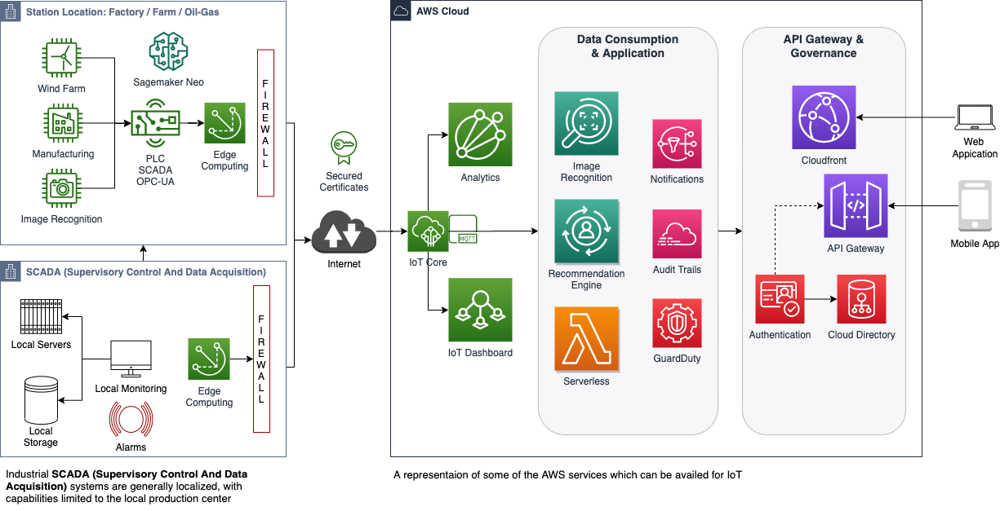

# Additional Tips and Reference material

This section is not relevant to the lab, but added for extra reading later.

## Hardware

### Connecting multiple hardware

The 3.3V pin of the pin, does not give more than 50mA. If you want to control a LED strip, or multiple components, make sure each of them have their own power supply.

### HATs & pHATs
You can extend your pi with more external hardware using different types of **HATs** (**H**ardware **A**ttached on **T**op) or **pHATs** (for Pi Zero's).

Some of my favourite HATs and pHATs are made by [**Pimoroni**](https://shop.pimoroni.com/collections/hats);
 * [Sense Hat](https://www.raspberrypi.org/products/sense-hat/)
 * [Ubercorn & Unicorn HAT](https://shop.pimoroni.com/products/ubercorn)
 * [Enviro + Air](https://shop.pimoroni.com/products/enviro?variant=31155658457171)
 * [Automation HAT](https://shop.pimoroni.com/products/automation-hat)
 * [Inky pHAT](https://shop.pimoroni.com/products/inky-phat?variant=12549254217811)

Most of that HATs and pHATs have their own python library with good examples and community support.

## Use cases

